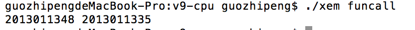

#01-03 v9cpu

###分析和实验funcall.c

- 实验截图
 
 	

- funcall中的堆栈有多大？是内核态堆栈还是用户态堆栈

	124MB，总共的内存大小为128，其中4MB为FS_SZ，内核态

- funcall中的全局变量ret放在内存中何处？如何对它寻址？

	地址为0xA8，从指令地址0x18的地方看到，对应的机器码为8c45，所以对应的操作为SG 0x8c，所以ret的地址就为  8c+1c 为A8

- funcall中的字符串放在内存中何处？如何对它寻址？

	放在内存地址中，从0x90开始，里面的内容对应的字符串的符号

- 局部变量i在内存中的何处？如何对它寻址？

	0x07bfffdc,使用的是SL命令，从指令地址0x20的地方看到，对应的机器码为0440，所以对应的操作为SL 0x04，所以i的地址就为  07bfffd8+04 为07bfffdc

- 当前系统是处于中断使能状态吗？

	不处于中断使能状态

- funcall中的函数参数是如何传递的？函数返回值是如何传递的？

	使用的是堆栈功能，在调用函数钱将函数参数压入栈中，在函数中从栈调用即可；返回值的话，是存入变量a中。

- 分析并说明funcall执行文件的格式和内容
	
	内容是hdr数据包括magic数、bss、entry、flags，然后是text（程序指令），最后是data（程序数据）。 　
